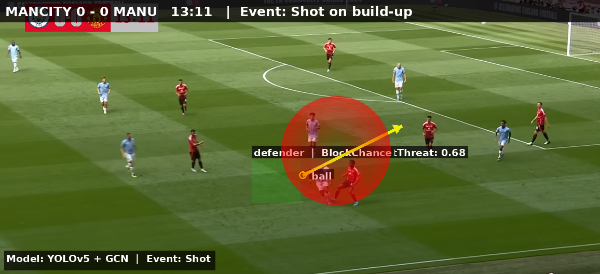
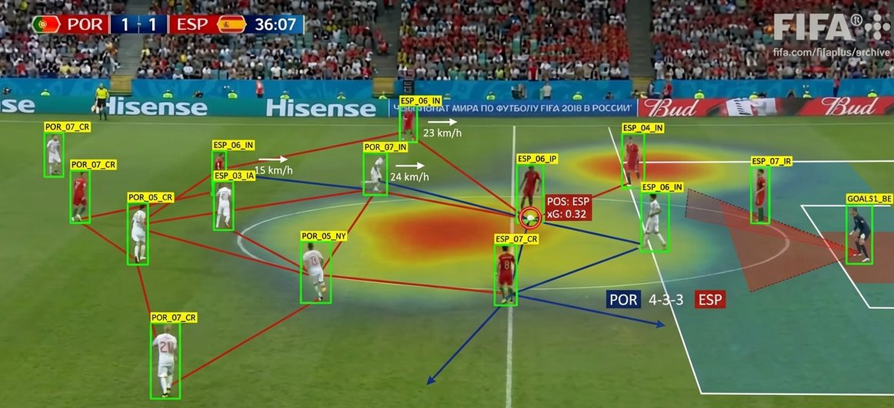

# GoalHighlighter.AI

Automated Football Goal Highlight Detection using Multi-Modal AI
GoalHighlighter.AI is a cutting-edge system designed to automatically detect goal events from full-length football broadcast videos. Leveraging computer vision, audio analysis, and OCR, the platform identifies goal highlights with high precision—enabling scalable highlight generation without manual labeling.

## Features

- **End-to-End Video Analytics Pipeline**  
  Processes raw match footage into frame sequences, synchronizes audio and visual streams, and outputs temporally segmented goal highlight clips.  
- **Deep Learning-Based Object Detection**  
  Utilizes a YOLOv5 architecture to track the ball, players, and key field elements in real time, handling motion blur, occlusions, camera cuts, and diverse broadcast angles.  
- **Scoreboard Detection & OCR**  
  Extracts score information from frames and tracks score changes over time. Score deltas act as high-confidence signals for goal confirmation and temporal alignment.  
- **Audio Event Analysis**  
  Detects crowd cheer spikes using short-time Fourier transforms (STFTs) and energy envelope analysis. Audio cues are fused with visual signals to reduce false positives.  
- **Multi-Signal Fusion**  
  Combines visual detections, OCR score changes, and audio peaks to robustly infer goal events under noisy, real-world conditions.  

- **Optimized for CPU Performance**  
  Pipeline optimized for frame-level inference on Intel UHD Graphics. Frame sampling and batch processing reduce computational load, with GPU/CUDA acceleration planned for future real-time deployment.
  
## How It Works

1. Input full match video → Extract frames and audio  
2. Detect players, ball, and field elements using YOLOv5  
3. Track scoreboard changes with OCR  
4. Analyze audio for crowd excitement peaks  
5. Fuse signals to detect and timestamp goal events  
6. Output goal highlight clips  

## Application Screenshots

  
  
  

## Technical Highlights

- **Object Detection:** YOLOv5, motion blur & occlusion handling  
- **OCR:** Scoreboard tracking and temporal alignment  
- **Audio Analysis:** STFT, energy envelope detection, crowd cheer identification  
- **Fusion Logic:** Multi-modal integration for high precision  
- **Performance Optimization:** CPU-bound inference with batch processing; scalable to GPU

## Future Enhancements

- GPU acceleration for real-time processing  
- Integration with streaming platforms for live highlight generation  
- Enhanced deep learning models for multi-camera broadcast scenarios  
- Integration with VR/AR for better visualization techniques and analysis

